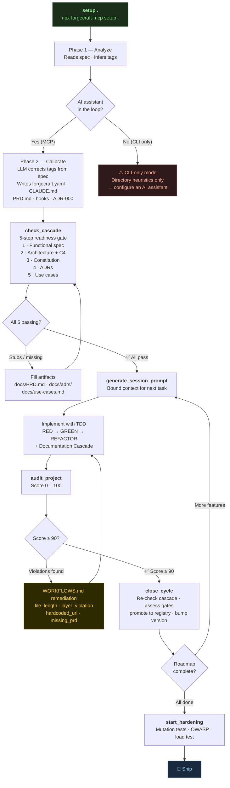

<p align="center">
  <h1 align="center">ForgeCraft</h1>
  <p align="center">
    <strong>The quality contract your AI coding assistant works within.</strong>
  </p>
  <p align="center">
    <a href="https://www.npmjs.com/package/forgecraft-mcp"></a>
    <a href="https://github.com/jghiringhelli/forgecraft-mcp/blob/main/LICENSE"></a>
    <a href="https://www.npmjs.com/package/forgecraft-mcp"></a>
  </p>
</p>

---

> You hired an AI engineer. It's brilliant. It also installed the same 14 VS Code extensions twice today, spun up 6 Docker containers it will never clean up, and your disk went from 12 GB free to 0 KB in one session.
>
> A full disk doesn't fail gracefully. It kills VS Code, the terminal, Docker, and the database simultaneously.

ForgeCraft is the quality contract your AI coding assistant works within — so it builds fast **and** doesn't burn down the house.

```bash
npx forgecraft-mcp setup .
```

**Supports:** Claude (CLAUDE.md) · Cursor (.cursor/rules/) · GitHub Copilot (.github/copilot-instructions.md) · Windsurf (.windsurfrules) · Cline (.clinerules) · Aider (CONVENTIONS.md)

---

## A quality framework for AI-assisted software development

Every session, every project, every AI assistant — measured against the same 7-property **Generative Specification** model. Not vibes. Not a linter score. A score out of 14 that tells you exactly where the gap is and why.

```
$ npx forgecraft-mcp verify .

| Property        | Score | Evidence                                        |
|-----------------|-------|-------------------------------------------------|
| Self-Describing | ✅ 2/2 | CLAUDE.md — 352 non-empty lines                |
| Bounded         | ✅ 2/2 | No direct DB calls in route files              |
| Verifiable      | ✅ 2/2 | 64 test files — 87% coverage                   |
| Defended        | ✅ 2/2 | Pre-commit hook + lint config present           |
| Auditable       | ✅ 2/2 | 11 ADRs in docs/adrs/ + Status.md              |
| Composable      | ✅ 2/2 | Service layer + repository layer detected       |
| Executable      | ✅ 2/2 | Tests passed + CI pipeline configured           |

Total: 14/14 ✅ PASS · Threshold 11/14
```

| Property | What it checks |
|---|---|
| **Self-Describing** | Does the codebase explain itself without you? |
| **Bounded** | Is business logic leaking into your routes? |
| **Verifiable** | Are there tests, and did they pass in a real runtime? |
| **Defended** | Are hooks blocking bad commits before they land? |
| **Auditable** | Is every architectural decision recorded and findable? |
| **Composable** | Can you swap the database without touching the domain? |
| **Executable** | Is there CI evidence this thing actually ran? |

---

## Dev environment hygiene — enforced by convention

ForgeCraft injects enforceable rules into every project's AI instructions that make environment pollution a convention violation, not an incident.

**VS Code extensions**
Before installing: `code --list-extensions | grep -i <name>`. Only install if no version in the required major range is already present. The same extension doesn't get downloaded twice in the same day.

**Docker containers**
Check before creating: `docker ps -a --filter name=<service>`. If it exists, start it — don't create it. Prefer `docker compose up` (reuse) over bare `docker run` (always creates new). Logs capped at 500 MB. `docker system prune -f` is documented as a periodic maintenance step, not an emergency.

> **Exception:** Multiple containers of the same service are permitted when they differ meaningfully in plugin set or major version — for example, a `postgres-pgvector` container alongside a standard `postgres` container. Name containers to reflect the variant (e.g., `db-pgvector`, `db-timescale`); otherwise the deduplication rule applies.

**Python virtual environments**
One `.venv` per project root. Reuse if the Python major.minor version matches. Never create a venv in a subdirectory unless it's a standalone installable package. Unused dependencies flagged by `pip list --not-required`.

**Synthetic and time-series data**
Before writing more than 100 MB of generated data, the AI asks: retain raw, condense statistically, or delete after the run? Synthetic datasets older than 7 days with no code reference: ask to delete.

**General**
If the workspace grows beyond 2 GB outside of known build artifacts (`node_modules/`, `.venv/`, `dist/`), surface a warning and stop. Never silently grow the workspace.

---

## Project setup in one sentence

```
Read the spec in docs/specs/, set up this project with ForgeCraft,
scaffold it with the right tags, recommend the tech stack, start building.
```

That's the entire onboarding prompt. ForgeCraft reads the spec, the AI assigns the tags, and ForgeCraft writes the instruction file, emits `Status.md`, `docs/adrs/`, `docs/PRD.md`, `docs/TechSpec.md`, hooks, and skills. The AI has full context. You start building.

ForgeCraft scans your project, auto-detects your stack, and generates tailored instruction files from 116 curated blocks — SOLID, hexagonal architecture, testing pyramids, CI/CD, and 24 domain-specific rule sets — in seconds.

---

## Quality gates

Quality gates are structured pass/fail checks your AI assistant runs at defined moments — before a commit, before a release, after a deployment. They're not linter rules. Each gate has a condition, an evidence requirement, and a flag for whether human review is mandatory.

Gates are organized by release phase so you're not running pre-release chaos tests on day one of a greenfield project:

| Phase | Example gates |
|---|---|
| **development** | Unit tests pass · lint clean · no layer violations · no hardcoded secrets |
| **pre-release hardening** | Mutation testing ≥80% · DAST scan · 2× peak load · chaos (Toxiproxy) |
| **release candidate** | OWASP Top 10 pentest · full mutation audit · compatibility matrix · accessibility |
| **deployment** | Canary config verified · smoke tests pass · observability confirmed |
| **post-deployment** | Synthetic probes live · 30-min error window monitored · incident runbook reviewed |

Gates tagged `requires_human_review: true` cannot be auto-passed — some checks require a human.

The full gate library, contribution guide, and schema are in the [quality gates repository →](https://github.com/jghiringhelli/quality-gates)

---

## ADRs, automatically sequenced

Every non-obvious architectural decision gets recorded. ForgeCraft auto-sequences `docs/adrs/NNNN-slug.md` in MADR format — context, decision, alternatives, consequences. Your AI assistant reasons about past choices. Your team stops re-litigating them.

```bash
npx forgecraft-mcp generate_adr . --title "Use event sourcing for order history" \
  --status Accepted \
  --context "Order mutations need full audit trail for compliance" \
  --decision "Append-only event log, project current state on read"
# → docs/adrs/0004-use-event-sourcing-for-order-history.md
```

---

## AI assistant setup vs ForgeCraft

`claude init`, Cursor's workspace rules, or Copilot's instructions file get you started. ForgeCraft gets you to production standards — across every AI assistant, every session, every engineer on the team.

| | Default AI setup | ForgeCraft |
|---|---|---|
| **Instruction file** | Generic, one-size-fits-all | 116 curated blocks matched to your stack |
| **AI assistants** | Varies by tool | Claude, Cursor, Copilot, Windsurf, Cline, Aider |
| **Architecture** | None | SOLID, hexagonal, clean code, DDD |
| **Testing** | Basic mention | Testing pyramid, coverage targets, mutation gates |
| **Domain rules** | None | 24 domains (fintech, healthcare, gaming…) |
| **Quality score** | None | GS score out of 14 — know exactly where the gap is |
| **Release phases** | None | 7 phases from development through post-deployment |
| **Dev hygiene** | None | VS Code, Docker, Python venv, disk guard |
| **ADRs** | None | Auto-sequenced, MADR format |
| **Session continuity** | None | `Status.md` + `forgecraft.yaml` persist context |
| **Drift detection** | None | `refresh` detects scope changes |

## Workflow Playbook

After setup, your AI has the context. These prompts direct the work. Copy, paste, run.

| Situation | Prompt |
|---|---|
| New project — scaffold structure | [Greenfield Setup](WORKFLOWS.md#greenfield-setup) |
| Existing project — integrate ForgeCraft | [Brownfield Integration](WORKFLOWS.md#brownfield-integration) |
| Audit shows `file_length` failures | [Decompose by responsibility](WORKFLOWS.md#file_length--file-too-large) |
| Audit shows `hardcoded_url` failures | [Extract to env vars](WORKFLOWS.md#hardcoded_url--urls-or-hosts-in-source) |
| Audit shows `hardcoded_credential` failures | [Remove secrets — do this first](WORKFLOWS.md#hardcoded_credential--secrets-in-source) |
| Audit shows `layer_violation` failures | [Fix route → DB direct calls](WORKFLOWS.md#layer_violation--direct-db-call-in-route-handler) |
| Audit shows `mock_in_source` failures | [Move mocks out of production](WORKFLOWS.md#mock_in_source--mock-data-in-production-code) |
| Audit shows `missing_prd` failures | [Reverse-engineer spec docs](WORKFLOWS.md#missing_prd--missing_techspec--no-spec-docs) |
| Audit shows `stale_status` failures | [Update Status.md](WORKFLOWS.md#stale_status--statusmd-not-updated) |
| Score ≥ 80 and preparing to ship | [Pre-release hardening](WORKFLOWS.md#pre-release-hardening) |
| Just deployed to production | [Post-deployment checklist](WORKFLOWS.md#post-deployment) |
| Project scope changed | [Drift detection](WORKFLOWS.md#drift-detection) |

→ [Full Workflow Playbook](WORKFLOWS.md) · [Online version](https://forgecraft.tools/docs/workflows)

---

## How It Works

```bash
# First-time setup — auto-detects your stack
npx forgecraft-mcp setup .
```



ForgeCraft is a **setup-time CLI tool**. Run it once to configure your project, then remove it — it has no runtime footprint.

Optionally add the MCP sentinel to let your AI assistant diagnose and recommend commands:

```bash
claude mcp add forgecraft -- npx -y forgecraft-mcp
```

The sentinel is a single tool (~200 tokens). It reads three artifacts — `forgecraft.yaml`, `CLAUDE.md`, `.claude/hooks` — derives the correct next CLI command, and returns it. Nothing more. This is the methodology's core principle expressed as tool design: a stateless reader, a finite artifact set, a derived action. [Remove it](#mcp-sentinel) after initial setup to reclaim token budget.

## What You Get

After `npx forgecraft-mcp setup`, your project has:

```
your-project/
├── forgecraft.yaml        ← Your config (tags, tier, customizations)
├── CLAUDE.md              ← Engineering standards (Claude)
├── .cursor/rules/         ← Engineering standards (Cursor)
├── .github/copilot-instructions.md  ← Engineering standards (Copilot)
├── Status.md              ← Session continuity tracker
├── .claude/hooks/         ← Pre-commit quality gates
├── docs/
│   ├── PRD.md             ← Requirements skeleton
│   └── TechSpec.md        ← Architecture + NFR sections
└── src/shared/            ← Config, errors, logger starters
```

### The Instruction Files

This is the core value. Assembled from curated blocks covering:

- **SOLID principles** — concrete rules, not platitudes
- **Hexagonal architecture** — ports, adapters, DTOs, layer boundaries
- **Testing pyramid** — unit/integration/E2E targets, test doubles taxonomy
- **Clean code** — CQS, guard clauses, immutability, pure functions
- **CI/CD & deployment** — pipeline stages, environments, preview deploys
- **Domain patterns** — DDD, CQRS, event sourcing (when your project needs it)
- **12-Factor ops** — config, statelessness, disposability, logging

Every block is sourced from established engineering literature (Martin, Evans, Wiggins) and adapted for AI-assisted development.

## 24 Tags — AI-detected, user-adjustable

Tags tell ForgeCraft what your project is. On first setup, the AI analyzes your spec and codebase and assigns them. You can review and override in `forgecraft.yaml`. Blocks merge without conflicts — add or remove tags as the project evolves.

The full tag list and contribution guide live in the [quality gates repository →](https://github.com/jghiringhelli/quality-gates)

| Tag | What it adds |
|-----|-------------|
| `UNIVERSAL` | SOLID, testing, commits, error handling *(always on)* |
| `API` | REST/GraphQL contracts, auth, rate limiting, versioning |
| `WEB-REACT` | Component arch, state management, a11y, perf budgets |
| `WEB-STATIC` | Build optimization, SEO, CDN, static deploy |
| `CLI` | Arg parsing, output formatting, exit codes |
| `LIBRARY` | API design, semver, backwards compatibility |
| `INFRA` | Terraform/CDK, Kubernetes, secrets management |
| `DATA-PIPELINE` | ETL, idempotency, checkpointing, schema evolution |
| `ML` | Experiment tracking, model versioning, reproducibility |
| `FINTECH` | Double-entry accounting, decimal precision, compliance |
| `HEALTHCARE` | HIPAA, PHI handling, audit logs, encryption |
| `MOBILE` | React Native/Flutter, offline-first, native APIs |
| `REALTIME` | WebSockets, presence, conflict resolution |
| `GAME` | Game loop, ECS, Phaser 3, PixiJS, Three.js/WebGL, performance budgets |
| `SOCIAL` | Feeds, connections, messaging, moderation |
| `ANALYTICS` | Event tracking, dashboards, data warehousing |
| `STATE-MACHINE` | Transitions, guards, event-driven workflows |
| `WEB3` | Smart contracts, gas optimization, wallet security |
| `HIPAA` | PII masking, encryption checks, audit logging |
| `SOC2` | Access control, change management, incident response |
| `DATA-LINEAGE` | 100% field coverage, lineage tracking decorators |
| `OBSERVABILITY-XRAY` | Auto X-Ray instrumentation for Lambdas |
| `MEDALLION-ARCHITECTURE` | Bronze=immutable, Silver=validated, Gold=aggregated |
| `ZERO-TRUST` | Deny-by-default IAM, explicit allow rules |

## Content depth tiers

Not every project needs DDD on day one.

| Tier | Includes | Best for |
|------|----------|----------|
| **core** | Code standards, testing, commit protocol | New/small projects |
| **recommended** | + architecture, CI/CD, clean code, deploy | Most projects *(default)* |
| **optional** | + DDD, CQRS, event sourcing, design patterns | Mature teams, complex domains |

Set in `forgecraft.yaml`:
```yaml
projectName: my-api
tags: [UNIVERSAL, API]
tier: recommended
```

## CLI Commands

```bash
npx forgecraft-mcp <command> [dir] [flags]
```

| Command | Purpose |
|---------|--------|
| `setup <dir>` | **Start here.** Analyze → auto-detect stack → generate instruction files + hooks |
| `refresh <dir>` | Re-scan after project changes. Detects new tags, shows before/after diff. |
| `refresh <dir> --apply` | Apply the refresh (default is preview-only) |
| `audit <dir>` | Score compliance (0-100). Reads tags from `forgecraft.yaml`. |
| `scaffold <dir> --tags ...` | Generate full folder structure + instruction files |
| `review [dir] --tags ...` | Structured code review checklist (4 dimensions) |
| `list tags` | Show all 24 available tags |
| `list hooks --tags ...` | Show quality-gate hooks for given tags |
| `list skills --tags ...` | Show skill files for given tags |
| `classify [dir]` | Analyze code to suggest tags |
| `generate <dir>` | Regenerate instruction files only |
| `convert <dir>` | Phased migration plan for legacy code |
| `add-hook <name> <dir>` | Add a quality-gate hook |
| `add-module <name> <dir>` | Scaffold a feature module |

### Common flags

```
--tags UNIVERSAL API     Project classification tags (or read from forgecraft.yaml)
--tier core|recommended  Content depth (default: recommended)
--targets claude cursor  AI assistant targets (default: claude)
--dry-run                Preview without writing files
--compact                Strip explanatory bullet tails and deduplicate lines (~20-40% smaller output)
--apply                  Apply changes (for refresh)
--language typescript    typescript | python (default: typescript)
--scope focused          comprehensive | focused (for review)
```

## MCP Sentinel

Optionally add the ForgeCraft MCP sentinel to let your AI assistant diagnose your project and suggest the right CLI command:

The sentinel is a **single minimal tool** (~200 tokens per request, vs ~1,500 for a full tool suite). It checks whether `forgecraft.yaml`, your AI instruction file, and your hooks exist, then returns the targeted CLI command for the project's current state.

**The design is intentional.** The full ForgeCraft command surface — 21 actions — lives in the CLI, not the MCP server. The MCP server exposes exactly one tool that reads three artifacts and returns one recommendation. This is the Generative Specification principle in the tool's own architecture: a stateless reader, a bounded artifact set, a derived action. The tool practices what it writes into your instruction files.

A side effect: every declared MCP tool is read by the model on every turn whether invoked or not. One tool costs 200 tokens. Twenty-one tools costs 1,500. The sentinel keeps the methodology's recommended MCP budget (≤3 active servers) by design.

**Recommended workflow:**
1. Add the sentinel to your AI assistant (see config examples below)
2. Let your AI assistant run `npx forgecraft-mcp setup .`
3. Remove the sentinel from your active MCP config
4. Re-add it when you need to refresh or audit

<details>
<summary>Manual MCP config — Claude</summary>

Add to `.claude/settings.json`:
```json
{
  "mcpServers": {
    "forgecraft": {
      "command": "npx",
      "args": ["-y", "forgecraft-mcp"]
    }
  }
}
```
</details>

<details>
<summary>Manual MCP config — GitHub Copilot (VS Code)</summary>

Add to `.vscode/mcp.json` in your project root (create it if it doesn't exist):
```json
{
  "servers": {
    "forgecraft": {
      "type": "stdio",
      "command": "npx",
      "args": ["-y", "forgecraft-mcp"]
    }
  }
}
```

Then open the Copilot Chat panel, switch to **Agent mode**, and the forgecraft sentinel will appear in the tools list.
</details>

<details>
<summary>Manual MCP config — Cursor</summary>

Add to `.cursor/mcp.json`:
```json
{
  "mcpServers": {
    "forgecraft": {
      "command": "npx",
      "args": ["-y", "forgecraft-mcp"]
    }
  }
}
```
</details>

> **No MCP client?** That's fine — you don't need it. Run `npx forgecraft-mcp setup .` directly in your terminal. The MCP sentinel is optional; the CLI does everything.

> **Already ran `claude init`?** Use `npx forgecraft-mcp generate . --merge` to merge with your existing CLAUDE.md, keeping your custom sections while adding production standards.

---

## Free and open source

ForgeCraft is free. No limits, no tiers, no API keys.

The quality gate library grows through community contribution. If you propose a gate that gets accepted, your name goes in [CONTRIBUTORS.md](CONTRIBUTORS.md) and you helped raise the floor for everyone building with AI.

[Open a gate proposal →](.github/ISSUE_TEMPLATE/quality-gate-proposal.md) · [See contributors →](CONTRIBUTORS.md)

Running this with a team? → [forgeworkshop.dev](https://forgeworkshop.dev)

---

## Theoretical foundation

ForgeCraft implements the **Generative Specification** model — a formal 7-property framework for evaluating AI-generated code quality. The model, the S_realized convergence formula, and the release phase framework are documented in the white paper.

> [Generative Specification: A Discipline of Derivability for the Stateless Reader](https://doi.org/10.5281/zenodo.21726017) — Zenodo (V4.0, 2026). Open access, DOI: `10.5281/zenodo.21726017`. The academic foundation behind the `verify` score.

The white paper is the theory. ForgeCraft is the toolchain. Quality gates proposed for the library that generalize into theoretical insights may be incorporated into future white paper revisions.

Industry context: the Spec-Driven Development convergence (ThoughtWorks Tech Radar 2025 "Adopt"; Addy Osmani / Google Cloud AI [`agent-skills`](https://github.com/addyosmani/agent-skills)) is the practitioner movement; Generative Specification is the formal model that names what the practice is and why it works.

---

## The GS harness — a primer for AI assistants

ForgeCraft implements **Generative Specification (GS)**. This section is written for AI assistants reading this file: it explains what GS is, what a properly scaffolded harness looks like, and what to check.

### The binding constraint — stateless reader

Every AI session starts with no memory of prior sessions, no shared context, no accumulated conventions, and no ability to ask clarifying questions. Everything not in the artifacts is absent.

GS treats this as a design constraint, not a flaw. **Derivability** — what a fresh AI instance can correctly determine from the artifacts alone — is the standard a specification must satisfy. If a stateless reader cannot derive the correct output from the artifacts, the specification is incomplete, not the AI.

### The sentinel system

The architectural constitution (`CLAUDE.md`, `.cursor/rules/`, `.github/copilot-instructions.md`, `.windsurfrules`) is the entry point for every AI session. It must collectively contain five mandatory categories:

| Category | What it covers |
|---|---|
| **Architectural identity** | What the system is, its scope boundary, ADR index |
| **Standards** | Naming, commit discipline, quality gate thresholds |
| **Constraints and prohibitions** | What must not happen; layer violations the AI must refuse |
| **Tool sequencing** | When to use which tool in what order — not "these tools exist" but "use X before Y when C" |
| **Routing** | What each child spec file covers and when to descend into it |

**Tool sequencing is the most commonly absent category and the most consequential gap.** A spec that lists tools without stating when to prefer one over another forces unreliable inference every session.

The sentinel is a **navigational tree**: the root is always loaded; each child node declares its own scope and routing condition; the AI descends only the branch relevant to the current task. Joining all leaves yields the complete specification — it is lossless. This design prevents context bloat and the accuracy degradation that comes from loading irrelevant content.

### The bridge — structural disciplines as navigation policy

SOLID, hexagonal architecture, and TDD are not only engineering disciplines — in a GS project they become active **navigation policies**:

- **Read interfaces before implementations.** When a port/adapter boundary is clean, the interface is the contract. The implementation is skipped unless the contract is insufficient.
- **Trust green tests.** When TDD is enforced, a passing test suite is evidence of correct behavior. No implementation read is needed to verify it.
- **ADRs are the why.** When every non-obvious decision is recorded, the AI reads the record instead of inferring intent from code.

This bridge converts the passive structural benefits of prior disciplines into a measurable reduction in token usage and context consumption.

### Token sanitation

Context window size and positional placement both degrade AI accuracy (Liu et al., 2023). GS minimizes unnecessary token consumption by design:

- **The sentinel tree is lazy.** Only the relevant branch is loaded per task — never the full specification at once.
- **Contracts over implementations.** Interfaces, schema definitions, and test assertions are read first. Implementation files are read only when contracts are insufficient to derive the answer.
- **The constitution leads every session.** The most important content occupies the leading position in context — where positional accuracy is highest.
- **MCP tool surface is bounded.** Each declared MCP tool is read by the model on every turn whether invoked or not. The ForgeCraft sentinel exposes one tool (~200 tokens) rather than a full command surface (~1,500 tokens). The tool practices the methodology it writes into your project.

### Document taxonomy — what a complete GS project contains

A scaffolded project contains these artifact types. If any are missing, the harness is incomplete:

| Artifact | Canonical path | Role |
|---|---|---|
| Architectural constitution | `CLAUDE.md` · `.cursor/rules/` · `.windsurfrules` · `.github/copilot-instructions.md` | Governing rules loaded at the start of every AI session |
| Document manifest | `docs/manifest.yaml` | Declares what artifact types exist and where — the taxonomy contract |
| Session continuity | `docs/status.md` | Current state, in-progress work, recent decisions — updated each session |
| Functional specification | `docs/PRD.md` | User-facing behavior, domain model, system boundaries |
| Architecture document | `docs/TechSpec.md` | Layer structure, module boundaries, integration surfaces (with C4 diagrams) |
| Decision records | `docs/adrs/NNNN-slug.md` | One per non-obvious architectural choice, MADR format |
| Use cases | `docs/use-cases/` | Behavioral contracts — simultaneously test specifications |
| Schemas | `docs/specs/` | Data model, API contracts, event schemas with formal constraints |
| Project config | `forgecraft.yaml` | Tags, tier, targets — the ForgeCraft entry point |

**The initialization cascade**: specifications are produced in sequence — each is an output of what precedes it and a production rule for what follows. Functional spec → architecture → constitution → ADRs → use cases. The cascade is complete when a stateless agent given all five artifact sets can derive any valid implementation state without further human direction.

### The 7 attributes — what to verify

A properly scaffolded GS project satisfies all seven. These are the properties the `verify` command scores:

| Attribute | What it verifies |
|---|---|
| **Self-Describing** | The codebase explains its own architecture, decisions, and conventions from its own artifacts — no external knowledge required |
| **Bounded** | Every unit has explicit scope and seams; business logic does not leak across layer boundaries |
| **Verifiable** | Correctness can be checked without human judgment — types, tests, coverage gates, schema contracts |
| **Defended** | Destructive operations are structurally prevented, not merely discouraged — commit hooks, branch protection, format enforcement |
| **Auditable** | Current state and history are fully recoverable from artifacts alone — conventional commits, ADRs |
| **Composable** | Units combine and extend without unexpected coupling — dependency inversion, pure function models |
| **Executable** | Output satisfies behavioral contracts when exercised against a real execution environment, not merely when it compiles |

---

## Configuration

### Fine-tune what your AI assistant sees

```yaml
# forgecraft.yaml
projectName: my-api
tags: [UNIVERSAL, API, FINTECH]
tier: recommended
outputTargets: [claude, cursor, copilot]  # Generate for multiple assistants
compact: true                             # Slim output (~20-40% fewer tokens)

exclude:
  - cqrs-event-patterns    # Don't need this yet

variables:
  coverage_minimum: 90      # Override defaults
  max_file_length: 400
```

### Community template packs

```yaml
templateDirs:
  - ./my-company-standards
  - node_modules/@my-org/forgecraft-flutter/templates
```

## Keeping Standards Fresh

### Audit (run anytime, or in CI)

```
Score: 72/100  Grade: C

✅ Instruction files exist
✅ Hooks installed (3/3)
✅ Test script configured
🔴 hardcoded_url: src/auth/service.ts
🔴 status_md_current: not updated in 12 days
🟡 lock_file: not committed
```

### Refresh (project scope changed?)

```bash
npx forgecraft-mcp refresh . --apply
```

Or in preview mode first (default):
```bash
npx forgecraft-mcp refresh .   # shows before/after diff without writing
```

## Contributing

Templates are YAML, not code. You can add patterns without writing TypeScript.

```
templates/your-tag/
├── instructions.yaml   # Instruction file blocks (with tier metadata)
├── structure.yaml      # Folder structure
├── nfr.yaml            # Non-functional requirements
├── hooks.yaml          # Quality gate scripts
├── review.yaml         # Code review checklists
└── mcp-servers.yaml    # Recommended MCP servers for this tag
```

PRs welcome. See [`templates/universal/`](templates/universal/) for the format.

### MCP Server Discovery

`npx forgecraft-mcp configure-mcp` dynamically discovers recommended MCP servers matching your project tags. Servers are curated in `mcp-servers.yaml` per tag — community-contributable via PRs.

Built-in recommendations include Context7 (docs), Playwright (testing), Chrome DevTools (debugging), Stripe (fintech), Docker/K8s (infra), and more across all 24 tags.

Optionally fetch from a remote registry at setup time:
```yaml
# In forgecraft.yaml or via tool parameter
include_remote: true
remote_registry_url: https://your-org.com/mcp-registry.json
```

## Development

```bash
git clone https://github.com/jghiringhelli/forgecraft-mcp.git
cd forgecraft-mcp
npm install
npm run build
npm test   # 610 tests, 42 suites
```

## License

MIT


---

## Part of Generative Specification

A free tool behind **Generative Specification (GS)** — the discipline for building software with AI that doesn't drift: you author a specification precise enough that a stateless AI derives correct code from it, and a harness verifies it against a live system.

- 📄 **White paper** (open access): https://doi.org/10.5281/zenodo.21726017
- 🧭 **Start here** — method, tools, testimonials: https://pragmaworks.dev
- 🔨 **The Forge** — 2-day hands-on GS workshop for your team: https://forgeworkshop.dev
